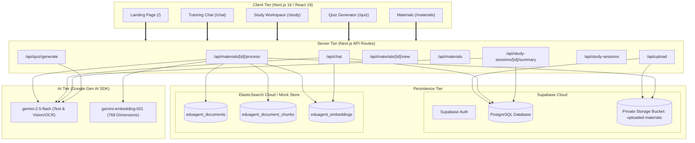

# EduAgent AI — Full Technical Audit & Architecture Review
**Author:** Principal Software Architect  
**Project:** EduAgent AI (Built for the Google Cloud Rapid Agent Hackathon)  
**Date:** June 22, 2026  

---

## Executive Summary

EduAgent AI is a modern, adaptive AI-powered learning workspace designed to offer persistent tutoring sessions based on general educational topics or custom-uploaded study materials. Structurally, it integrates a Next.js App Router frontend, a database storage layers orchestrated by Supabase, vector search indices hosted in ElasticSearch, and text generation/embeddings powered by Google Gemini.

While the landing page visual shell is premium and individual backend services (such as RAG chunking, OCR document parsing, and quiz generation) are well-written, **the application currently suffers from critical integration regressions that make key pages completely inoperable in production**. Specifically, the main `/chat` workspace crashes upon rendering due to a missing variable declaration, the `/study` page chat is broken due to a request payload mismatch, the Edge middleware is bypassed due to file naming issues, and the `/quiz` page is unable to fetch materials.

This report documents the factual implementation state, code flaws, architectural issues, and provides a clear remediation roadmap.

---

## 1. System Architecture Map & Diagram

EduAgent AI uses a hybrid AI RAG architecture combining SQL storage, vector lookup, and LLM reasoning.

### Text-Based System Architecture


### Component Details

#### A. Frontend Core
* **Framework:** Next.js `16.2.6` & React `19.2.6` (App Router architecture).
* **Styling:** Vanilla TailwindCSS `3.4.17` with custom HSL variables and Shadcn UI components.
* **Animations:** Framer Motion `12.10.5` for page transitions, 3D card flips, and list animations.
* **State Management:** Localized React hooks (`useState`, `useMemo`, `useCallback`) inside client panels. Authentication status is managed globally via React Context ([auth-context.tsx](file:///c:/Users/USER/Desktop/CODE%20PROJECTS/SMART%20TUTOR%20AI/src/context/auth-context.tsx)) and the [AuthProvider](file:///c:/Users/USER/Desktop/CODE%20PROJECTS/SMART%20TUTOR%20AI/src/providers/auth-provider.tsx) component.

#### B. Backend Services
* **API Endpoints:** Implemented as Next.js API Routes (Node.js runtime).
* **Auth Flow:** Synchronized between client hooks (`useAuth`) and server routes via `@supabase/ssr` cookies. Google OAuth redirects flow through the `/auth/callback` code exchanger to establish sessions.
* **Business Logic:** Logically partitioned inside `src/lib/` by sub-system:
  * `src/lib/supabase/`: Client, server, and cookie configurations.
  * `src/lib/elastic/`: Elasticsearch client requests and similarity utilities.
  * `src/lib/gemini/`: Model wrappers, prompt formatting, OCR transcription, and vector embedding requests.
  * `src/lib/materials/`: Extraction adapters, word-split chunking, and ingestion orchestrators.

#### C. Database Schema (Supabase PostgreSQL)
The schema consists of 6 primary tables with explicit Row Level Security (RLS) policies:
1. `courses`: Represents student courses. Fields: `id` (UUID), `user_id` (UUID references `auth.users`), `code` (text), `title` (text), `description` (text).
2. `study_sessions`: Chat rooms/study sessions. Fields: `id` (UUID), `user_id` (UUID references `auth.users`), `course_id` (UUID references `courses.id`), `title` (text), `status` (text: active/paused/completed), `duration_seconds` (int), `topics_covered` (JSONB), `last_message` (text), `summary` (text).
3. `study_messages`: Message history in a session. Fields: `id` (UUID), `session_id` (UUID references `study_sessions.id` with cascade delete), `user_id` (UUID references `auth.users`), `role` (text: user/assistant), `content` (text), `sources` (JSONB).
4. `uploaded_materials`: Document library tracking. Fields: `id` (UUID), `user_id` (UUID references `auth.users`), `session_id` (UUID references `study_sessions.id`), `course_id` (UUID references `courses.id`), `file_name` (text), `file_type` (text), `storage_path` (text), `status` (text: uploaded/processing/ready/failed/deleted), `error_message` (text), `chunk_count` (int), `summary` (text), `source_metadata` (JSONB), `deleted_at` (timestamptz).
5. `quizzes`: Quiz attempts. Fields: `id` (UUID), `user_id` (UUID references `auth.users`), `course_id` (UUID references `courses.id`), `material_id` (UUID references `uploaded_materials.id`), `type` (text: mcq/flashcard/short_answer), `score` (int), `accuracy` (numeric).
6. `quiz_questions`: Generated questions in a quiz. Fields: `id` (UUID), `quiz_id` (UUID references `quizzes.id` with cascade delete), `question` (text), `options` (JSONB), `correct_answer` (text), `user_answer` (text), `is_correct` (boolean).

#### D. Storage Infrastructure (Supabase Storage)
* **Bucket:** Private bucket `uploaded-materials` (`public = false`).
* **Upload Flow:** Client posts to `/api/upload` via Multipart Form Data. The server reads the stream, builds an isolated storage path (`userId/sessionId/timestamp-uuid-filename`), and uploads the file via the Supabase client.
* **Signed View urls:** Client requests signed URLs via POST to `/api/materials/[id]/view` which are valid for 10 minutes.

#### E. Search & Retrieval Layer (ElasticSearch Cloud)
* **Configuration:** Core functions are defined in [client.ts](file:///c:/Users/USER/Desktop/CODE%20PROJECTS/SMART%20TUTOR%20AI/src/lib/elastic/client.ts). If credentials are missing, or the HTTP request fails, the service falls back to a global mock store (`globalMock._mockElasticIndices`) in Next.js development.
* **Indices:**
  1. `eduagent_documents`: High-level file records.
  2. `eduagent_document_chunks`: Extracted raw text blocks.
  3. `eduagent_embeddings`: 768-dimension vector records mapping dense coordinates back to chunk IDs.
* **Retrieval Pipeline:** Query strings are converted to search vectors via Gemini. The system requests kNN cosine matching filtered by `user_id` and `session_id` (using `"sessionId.keyword"` in ElasticSearch). Chunks scoring below `0.62` are filtered out. If empty, the search falls back to the user's global materials.

#### F. AI Layer (Google Gemini Integration)
* **Client Wrapper:** [client.ts](file:///c:/Users/USER/Desktop/CODE%20PROJECTS/SMART%20TUTOR%20AI/src/lib/gemini/client.ts) initializes the new `@google/genai` SDK.
* **Models:**
  * `gemini-2.5-flash`: Content generation, summaries, OCR/VLM text extraction.
  * `gemini-embedding-001`: Vector embeddings (768 dimensions).
* **Fallback Mocks:** If the API key is missing or invalid, the client intercepts the failure and yields structured pre-compiled text answers (e.g. quantum computing, passive transport) and character-sinusoid vectors to keep local development running smoothly.

---

## 2. Feature Inventory

| Feature Name | Description | Status | Evidence / Notes |
| :--- | :--- | :--- | :--- |
| **Landing UI / Splash Screen** | Glassmorphic visual structure showcasing system capabilities and styling systems. | **Fully Working** | [page.tsx](file:///c:/Users/USER/Desktop/CODE%20PROJECTS/SMART%20TUTOR%20AI/src/app/page.tsx) |
| **Interactive Guest Demo Chat** | Public chatbox on the landing page enabling immediate LLM interaction with client rate limits. | **Fully Working** | [/api/demo-chat](file:///c:/Users/USER/Desktop/CODE%20PROJECTS/SMART%20TUTOR%20AI/src/app/api/demo-chat/route.ts) |
| **Supabase Authentication** | Email/Password login, Sign Up, and Google OAuth callback setups. | **Fully Working** | [auth-provider.tsx](file:///c:/Users/USER/Desktop/CODE%20PROJECTS/SMART%20TUTOR%20AI/src/providers/auth-provider.tsx) |
| **Document Ingestion & OCR Pipeline** | Text extraction from PDF, DOCX (Mammoth), PPTX (JSZip+XML), and Images (Gemini OCR). | **Working With Issues** | Sync execution on API thread; lacks bulk indexing in ElasticSearch. [extract.ts](file:///c:/Users/USER/Desktop/CODE%20PROJECTS/SMART%20TUTOR%20AI/src/lib/materials/extract.ts) |
| **My Materials Manager** | Library page for uploading, viewing (signed URL), and deleting materials. | **Fully Working** | [UploadWorkspace.tsx](file:///c:/Users/USER/Desktop/CODE%20PROJECTS/SMART%20TUTOR%20AI/src/components/upload/UploadWorkspace.tsx) |
| **Course Catalog List** | Dashboard to fetch, create, and list academic courses. | **Fully Working** | [courses/page.tsx](file:///c:/Users/USER/Desktop/CODE%20PROJECTS/SMART%20TUTOR%20AI/src/app/courses/page.tsx) |
| **Pomodoro Study Manager** | Study dashboard with custom Pomodoro timer circles, topic trackers, and notes storage. | **Fully Working** | [study/page.tsx](file:///c:/Users/USER/Desktop/CODE%20PROJECTS/SMART%20TUTOR%20AI/src/app/study/page.tsx) |
| **Quiz Execution Engine** | Interactive quiz interface supporting MCQs, 3D Flashcards, and Short Answer validations. | **Fully Working** | [quiz/page.tsx](file:///c:/Users/USER/Desktop/CODE%20PROJECTS/SMART%20TUTOR%20AI/src/app/quiz/page.tsx) |
| **RAG Retrieval Engine** | Embedding generation, search parameters, relevance thresholding (`>=0.62`), and source labeling. | **Fully Working** | [retrieval.ts](file:///c:/Users/USER/Desktop/CODE%20PROJECTS/SMART%20TUTOR%20AI/src/lib/materials/retrieval.ts) |
| **Study Sessions AI Summary** | Backend AI summary generation of past session chat logs. | **Partially Implemented** | Backend route works, but Frontend has a hardcoded simulator with mockup text. [summary/route.ts](file:///c:/Users/USER/Desktop/CODE%20PROJECTS/SMART%20TUTOR%20AI/src/app/api/study-sessions/[sessionId]/summary/route.ts) |
| **Course Tagging (@mention scoping)** | Mention popover allowing users to type `@` and choose a course to scope the session. | **Partially Implemented** | UI is visual-only; frontend passes `courseId` to `/api/chat`, but backend ignores it completely. [ChatInput.tsx](file:///c:/Users/USER/Desktop/CODE%20PROJECTS/SMART%20TUTOR%20AI/src/components/chat/ChatInput.tsx) |
| **AI Tutoring Chat Interface** | Workspace containing chat threads, file attachments, and conversational memory. | **Broken** | **Unrenderable.** Component crashes on load due to `ReferenceError: activeSession is not defined`. [StudyWorkspace.tsx](file:///c:/Users/USER/Desktop/CODE%20PROJECTS/SMART%20TUTOR%20AI/src/components/chat/StudyWorkspace.tsx) |
| **Inline Study Chat** | Floating sidebar chat inside active Pomodoro study session. | **Broken** | Client sends a string `message`, but `/api/chat` expects a `messages` array, yielding a 400 error. [study/page.tsx](file:///c:/Users/USER/Desktop/CODE%20PROJECTS/SMART%20TUTOR%20AI/src/app/study/page.tsx#L283-L300) |
| **AI Quiz Ingestion Setup** | Generating quiz questions based on selected study documents. | **Broken** | **API Call / Dropdown Bug.** In quiz setup, GET is sent to `/api/upload` (fails with 405) instead of `/api/materials`, making the selector show empty. [quiz/page.tsx](file:///c:/Users/USER/Desktop/CODE%20PROJECTS/SMART%20TUTOR%20AI/src/app/quiz/page.tsx#L410) |
| **RAG Quiz Content Generation** | Quiz questions generated directly from study material contents. | **Broken** | The backend `/api/quiz/generate` endpoint only reads the *filename* of the material, not the actual text chunks, generating questions from pure academic guess-work. [generate/route.ts](file:///c:/Users/USER/Desktop/CODE%20PROJECTS/SMART%20TUTOR%20AI/src/app/api/quiz/generate/route.ts#L94-L107) |
| **Course Detail View Route** | Route `/courses/[id]` when clicking on a course card. | **Broken / Missing** | Next.js route folder does not exist, yielding a 404. [courses/page.tsx](file:///c:/Users/USER/Desktop/CODE%20PROJECTS/SMART%20TUTOR%20AI/src/app/courses/page.tsx#L392) |
| **Progress Analytics Page** | Page showcasing student strengths and weaknesses. | **Not Implemented** | Route is protected, but no page layout or schema fields exist. |
| **Lesson Scheduling Planner** | Setup page for recurring tutoring hours. | **Not Implemented** | Route is protected, but no page layout or schema fields exist. |
| **Voice Tutoring Engine** | Spoken audio explanations and natural real-time speech interactions. | **Not Implemented** | `src/lib/voice` is an empty folder; no components or routes are present. |

---

## 3. Route Audit

| Route Path | Purpose | Key Component Used | API Dependencies | Status & Health |
| :--- | :--- | :--- | :--- | :--- |
| `/` | Landing page, interactive AI tutor demo, and login/signup modals. | `DemoChat`, `LoginForm`, `SignupForm` | `/api/demo-chat` | **Healthy.** Operates correctly. |
| `/chat` | Main AI tutoring chat workspace with persistent session selectors. | `StudyWorkspace`, `ChatContainer`, `ChatInput` | `/api/study-sessions`, `/api/chat`, `/api/materials` | **Broken.** Crashes on load (ReferenceError: `activeSession` is not defined). |
| `/courses` | Listing of student courses and modal to add new ones. | `CoursesPage`, `AddCourseModal` | `/api/courses` | **Healthy.** Able to add/list. (Note: child page navigation returns 404). |
| `/courses/[id]` | Detail page of a specific course. | *None* | *None* | **Broken / Missing.** 404 Not Found. |
| `/materials` | Manage library documents, drag-and-drop file uploads, and status monitors. | `UploadWorkspace` | `/api/study-sessions`, `/api/materials`, `/api/upload` | **Healthy.** Active upload and status rendering. |
| `/quiz` | Generator form and quiz-taking dashboard (MCQ/Flashcard/Short Answer). | `MCQQuestion`, `FlashcardQuestion`, `ShortAnswerQuestion` | `/api/courses`, `/api/upload` (should be `/api/materials`), `/api/quiz/generate` | **Broken.** Dropdown is empty because client requests GET `/api/upload` (fails with 405). |
| `/study` | Active study sessions involving Pomodoro, trackers, and inline assistant chat. | `PomodoroCircle`, `TopicTracker`, `QuickNotes`, `InlineChat` | `/api/courses`, `/api/chat` | **Broken.** Inline chat fails with 400 because payload lacks `messages` array. |
| `/schedule` | Set recurring lessons. | *None* | *None* | **Missing.** 404 Not Found. |
| `/progress` | View progress charts. | *None* | *None* | **Missing.** 404 Not Found. |

---

## 4. API Audit

| Method | Route | Purpose | Dependencies | Health & Architectural Risks |
| :--- | :--- | :--- | :--- | :--- |
| `POST` | `/api/demo-chat` | Public chatbot handler with local IP rate-limiting. | Gemini API | **Healthy.** Rate-limiter resets, mock answers fallback handles API key absence. |
| `GET` | `/api/courses` | List all user courses. | Supabase Client | **Healthy.** |
| `POST` | `/api/courses` | Add a new course. | Supabase Client | **Healthy.** Lacks validation on duplicate course codes. |
| `GET` | `/api/study-sessions` | List session histories with message relations. | Supabase Client | **Healthy.** Performs double sort (`updated_at` desc, then `created_at` asc for messages). |
| `POST` | `/api/study-sessions` | Initialize a new study session. | Supabase Client | **Healthy.** Auto-generates titles if input is empty. |
| `PATCH` | `/api/study-sessions/[sessionId]` | Update session parameters. | Supabase Client | **Healthy.** |
| `DELETE` | `/api/study-sessions/[sessionId]` | Permanently delete a session. | Supabase Client | **Healthy.** Cascade deletes database messages correctly. |
| `POST` | `/api/study-sessions/[sessionId]/summary` | Update session summary via Gemini. | Supabase Client, Gemini API | **Healthy.** Updates DB state correctly. (Note: Unused by Frontend). |
| `GET` | `/api/materials` | Retrieve list of uploaded files for session. | Supabase Client | **Healthy.** |
| `DELETE` | `/api/materials/[id]` | Soft-delete file, remove ES index embeddings, clean storage. | Supabase Client, ES Client | **Healthy.** Correctly cleans up external vectors and storage. |
| `POST` | `/api/materials/[id]/view` | Create 10-minute signed URL for file access. | Supabase Client | **Healthy (Rest Choice smell).** Uses POST instead of GET to generate signed URL. |
| `POST` | `/api/upload` | Upload physical file and save DB metadata. | Supabase Storage & DB, Ingestion | **High Risk.** Synchronously runs long-running `processMaterial` extraction/embedding on the HTTP thread, creating Vercel serverless function timeout risks (10s Hobby / 60s Pro). |
| `POST` | `/api/materials/[id]/process` | Re-run/trigger ingestion sequence. | Ingestion Pipeline | **High Risk.** Same HTTP timeout concern as upload route. |
| `POST` | `/api/quiz/generate` | Build list of questions using Gemini. | Supabase Client, Gemini API | **Partially Implemented.** Major quality concern: It only passes the *filename* of the material as context to Gemini, not the actual document text. |
| `GET` | `/api/auth/callback` | Exchange OAuth code for JWT session. | Supabase Server Client | **Healthy.** Handles redirect params and error callbacks. |

---

## 5. Technical Debt Report

### Code Smells & Bugs

1. **Unresolved Client Crash (StudyWorkspace.tsx):**
   * **Location:** [StudyWorkspace.tsx:L214, L369, L434](file:///c:/Users/USER/Desktop/CODE%20PROJECTS%20SMART%20TUTOR%20AI/src/components/chat/StudyWorkspace.tsx)
   * **Smell:** Reference error on undefined variable `activeSession`.
   * **Explanation:** The variable is referenced multiple times, but never declared in the outer scope of the function. The developers created `const activeSess` as a local variable inside the `logState` callback, but forgot to make `activeSession` a top-level computed state or memo hook.

2. **Inoperable Study Chat Payload Mismatch:**
   * **Location:** [study/page.tsx:L283-L300](file:///c:/Users/USER/Desktop/CODE%20PROJECTS/SMART%20TUTOR%20AI/src/app/study/page.tsx#L283-L300) vs [api/chat/route.ts:L67](file:///c:/Users/USER/Desktop/CODE%20PROJECTS/SMART%20TUTOR%20AI/src/app/api/chat/route.ts#L67)
   * **Smell:** Interface incompatibility.
   * **Explanation:** The frontend study page POSTs `{ message: string }` directly to the `/api/chat` route, but `/api/chat` checks for a `messages: ChatMessage[]` array and returns a `400 Bad Request` if it is absent.

3. **Wrong API Path Call on Quiz Setup:**
   * **Location:** [quiz/page.tsx:L410](file:///c:/Users/USER/Desktop/CODE%20PROJECTS/SMART%20TUTOR%20AI/src/app/quiz/page.tsx#L410)
   * **Smell:** Calling a POST-only endpoint (`/api/upload`) with a GET request instead of the intended GET `/api/materials` endpoint.
   * **Explanation:** Causes a 405 Method Not Allowed error, making the quiz document picker remain empty.

4. **REST Method Violation on Signed URLs:**
   * **Location:** [view/route.ts:L7](file:///c:/Users/USER/Desktop/CODE%20PROJECTS/SMART%20TUTOR%20AI/src/app/api/materials/%5Bid%5D/view/route.ts#L7)
   * **Smell:** Route handler uses POST instead of GET to retrieve a read-only signed URL path.

5. **Redundant Duplicate Dependencies:**
   * **Location:** [package.json:L14, L17](file:///c:/Users/USER/Desktop/CODE%20PROJECTS/SMART%20TUTOR%20AI/package.json)
   * **Smell:** Dead dependency packages.
   * **Explanation:** Imports both `@google/generative-ai` (legacy) and `@google/genai` (modern) in the package configuration. Only `@google/genai` is utilized in code.

### Architectural Concerns

1. **Non-Functional Edge Route Protection:**
   * **Location:** [proxy.ts](file:///c:/Users/USER/Desktop/CODE%20PROJECTS/SMART%20TUTOR%20AI/src/proxy.ts)
   * **Concern:** Edge routing middleware is not executing.
   * **Explanation:** Next.js explicitly requires edge middleware files to be named `middleware.ts`. Because the file was named `proxy.ts`, Next.js completely bypasses it, and none of the routes specified in `config.matcher` are protected. Client pages like `/quiz` lack page-level server guards, allowing guest access.

2. **Synchronous Ingestion Block on API Threads:**
   * **Location:** [ingestion.ts:L52](file:///c:/Users/USER/Desktop/CODE%20PROJECTS/SMART%20TUTOR%20AI/src/lib/materials/ingestion.ts#L52)
   * **Concern:** Synchronous request execution.
   * **Explanation:** Triggering processing blocks the HTTP thread. If a user uploads a document, Next.js blocks until the entire file is downloaded, parsed, chunked, embedded, and indexed. Larger documents will easily exceed Vercel's serverless function timeout (10 seconds for hobby tier).

3. **Inefficient Loop-Based Indexing:**
   * **Location:** [elastic.ts:L120](file:///c:/Users/USER/Desktop/CODE%20PROJECTS/SMART%20TUTOR%20AI/src/lib/materials/elastic.ts#L120)
   * **Concern:** Sequential HTTP operations.
   * **Explanation:** Indices are populated by iterating over chunks and sending separate PUT HTTP requests one-by-one to ElasticSearch (two per chunk, once for text, once for vectors). The codebase already defines a bulk indexing client wrapper `indexDocumentChunks` but it is not utilized in the ingestion path.

4. **Superficial Quiz Content Association:**
   * **Location:** [generate/route.ts:L94-L107](file:///c:/Users/USER/Desktop/CODE%20PROJECTS/SMART%20TUTOR%20AI/src/app/api/quiz/generate/route.ts#L94-L107)
   * **Concern:** Lack of real RAG lookup context in Quiz generation.
   * **Explanation:** The generator fetches the database file record simply to get the `file_name` string. The actual content chunks are never read. Gemini is asked: "Generate questions based on this title: Physics_101.pdf."

5. **Incomplete Route Mappings:**
   * **Concern:** Dead navigation items.
   * **Explanation:** Sidebar navigation contains links for `/schedule` and `/progress`, and the Courses section points to `/courses/[id]`. None of these pages or folder paths exist in `src/app`.

---

## 6. Merge Impact Analysis

A review of the commit tree indicates a series of branch merges between the `rapto` branch and the local `rayx` branch. 

### Inconsistencies & Regressions

1. **Typing & Import Fixes vs. Ingestion Inconsistencies:**
   * Commits `a4c6259` and `d72b3c8` patched issues with the node-native `pdf-parse` library breaking the build on hosting providers (Vercel/Netlify) by downgrading package configurations and resolving module imports.
   * However, these hotfixes bypassed the ingestion sequence test files rather than fixing the underlying mock frameworks, leaving test configurations in a state of drift.

2. **ChatInput Component Merge Collision:**
   * Commit `53047a9` and `db4456d` both added the custom `@mention` ChatInput interfaces, but the merge branch created duplicate code patterns where course scoping logic was wired up on the client container but completely stripped from the final `/api/chat` route parser, leaving a non-functional scope tag system.

3. **Accidental Variable Deletion:**
   * A merge collision in `StudyWorkspace.tsx` between state management hooks likely led to the replacement of the global memoized variable `activeSession` with a local variable `activeSess` scoped only to the `logState` utility. This left three active, downstream references to `activeSession` completely unmapped, causing the client crash.

---

## 7. Current Product Readiness

EduAgent AI is currently in a **Pre-Alpha (Developer Showcase)** state. It is not ready for Alpha testing due to critical runtime compile and execution crashes in the core chat and study session interfaces.

### Strengths
* **Visual Presentation:** The frontend landing page, floating layout, animations, and typography have a high-end feel.
* **Fallback Systems:** The mock fallbacks in the ElasticSearch client (`globalMock._mockElasticIndices`) and the Gemini client (`MOCK_ANSWERS`) are robust, enabling local developers to test features without cloud keys.
* **RAG Retrieval Quality:** The chunking mathematical token estimators, relevance threshold filtering, and cosine similarities are well-thought-out.

### Weaknesses (Launch Blockers)
* Core Tutoring page `/chat` throws a reference error and fails to load.
* Inline Pomodoro study chat fails with a HTTP 400 Bad Request.
* Document selection in Quiz generation triggers a HTTP 405 error.
* Route edge middleware is completely bypassed, leaving pages like `/quiz` accessible to anyone.
* The `/courses/[id]` route leads to a 404 page, breaking course-specific dashboards.

### Risks at Scale
* **Ingestion Timeouts:** Synchronously embedding documents chunk-by-chunk inside an API route handler will lead to serverless timeouts on hosting providers for any document exceeding 10–20 pages.
* **ElasticSearch Network Congestion:** Indexing thousands of chunks by sending sequential single-document PUT requests will trigger rate-limit throttling and degrade upload performance.

---

## 8. Recommended Development Roadmap

### Phase A: Immediate Priorities (Critical Bug Fixes)
*Target: Resolve all compile errors, runtime crashes, and path mismatches.*

1. **Fix `/chat` Client Reference Error:**
   * In [StudyWorkspace.tsx](file:///c:/Users/USER/Desktop/CODE%20PROJECTS/SMART%20TUTOR%20AI/src/components/chat/StudyWorkspace.tsx), declare `activeSession` at the component level:
     ```typescript
     const activeSession = useMemo(() => sessions.find((s) => s.id === activeSessionId) ?? null, [activeSessionId, sessions]);
     ```
2. **Correct the Quiz Page Materials Endpoint:**
   * In [quiz/page.tsx:L410](file:///c:/Users/USER/Desktop/CODE%20PROJECTS/SMART%20TUTOR%20AI/src/app/quiz/page.tsx#L410), modify the setup fetch call to query `/api/materials` instead of `/api/upload`.
3. **Align Study Chat Request Payload:**
   * In [study/page.tsx](file:///c:/Users/USER/Desktop/CODE%20PROJECTS/SMART%20TUTOR%20AI/src/app/study/page.tsx), update `InlineChat`'s `send()` function to submit an array under `messages` instead of a singular string under `message`:
     ```typescript
     body: JSON.stringify({
       sessionId,
       courseId,
       messages: [...chatMessages.map(m => ({ role: m.role, content: m.content })), userMsg]
     })
     ```
4. **Activate Route Protection Middleware:**
   * Rename `src/proxy.ts` to `src/middleware.ts` and ensure it exports the default middleware handler to allow Next.js to intercept requests and enforce Supabase authentication.

---

### Phase B: Short-Term Priorities (Feature Alignment)
*Target: Complete half-implemented elements to meet the original PRD requirements.*

1. **Wire Up Real AI Summaries:**
   * In [study/page.tsx](file:///c:/Users/USER/Desktop/CODE%20PROJECTS/SMART%20TUTOR%20AI/src/app/study/page.tsx), replace the simulation timer in `endSession()` with a fetch call to the backend endpoint:
     ```typescript
     const res = await fetch(`/api/study-sessions/${sessionId}/summary`, { method: "POST" });
     ```
2. **Implement Course Scoping Backend Logic:**
   * Modify [api/chat/route.ts](file:///c:/Users/USER/Desktop/CODE%20PROJECTS/SMART%20TUTOR%20AI/src/app/api/chat/route.ts) to read `courseId` from request parameters and link the session to the designated course.
3. **Feed Real Document Context to Quiz Generator:**
   * In [api/quiz/generate/route.ts](file:///c:/Users/USER/Desktop/CODE%20PROJECTS/SMART%20TUTOR%20AI/src/app/api/quiz/generate/route.ts), fetch document chunks from ElasticSearch matching the `materialId` and include the text as context in the prompt to Gemini.

---

### Phase C: Medium-Term Priorities (Performance & Scalability)
*Target: Relieve API blockages and accelerate database actions.*

1. **Asynchronous Material Processing:**
   * Redesign the upload flow: upload the file and immediately return a success response to the client. Offload the extraction, chunking, and embedding to a background worker or an edge handler that updates the database status field upon completion.
2. **Utilize Bulk ElasticSearch Indexing:**
   * Refactor `indexMaterialInElastic()` to compile all document chunks into an array and index them in a single batch request via the `indexDocumentChunks()` bulk helper.
3. **Clean Up Dead Dependencies:**
   * Remove the unused `@google/generative-ai` package from `package.json` and keep only `@google/genai`.

---

### Phase D: Long-Term Priorities (Future Growth)
*Target: Introduce missing system pages.*

1. **Create the Course Details Dashboard:**
   * Add a dynamic route `src/app/courses/[id]/page.tsx` allowing students to view documents and study sessions grouped under a course.
2. **Build Scheduling and Analytics Pages:**
   * Create pages for `/schedule` and `/progress` to match navigation options and complete the app shell.
